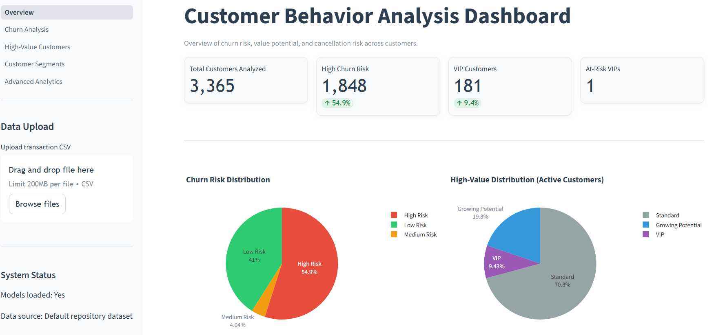
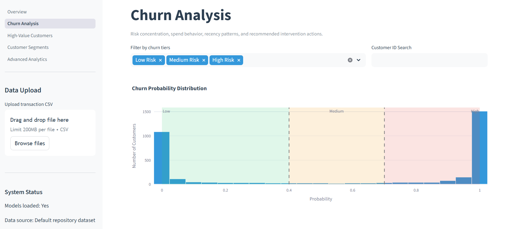
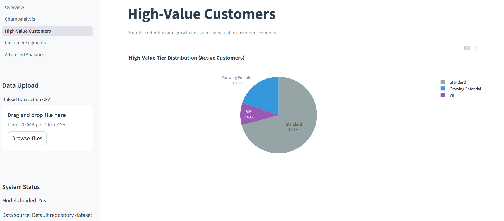
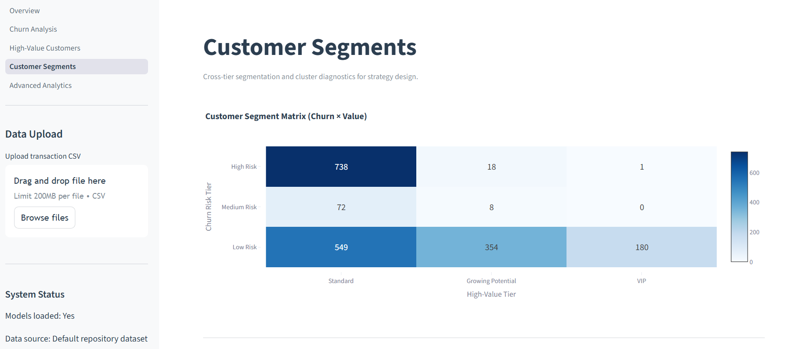
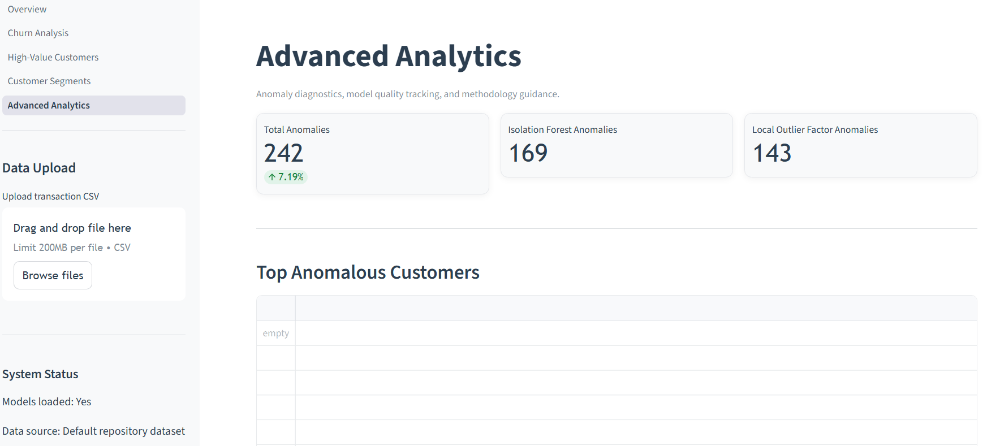

# Customer Behaviour Analytics & Risk Prediction System

## Project Overview
This project builds an end-to-end machine learning system to identify three business-critical customer outcomes from transactional retail data:
- Churn risk
- High-value customer potential
- Future high-risk cancellation behavior

The solution is designed for real-world customer lifecycle management, combining robust feature engineering, unsupervised behavioral signals, supervised prediction models, and a Streamlit interface for decision support.

## Project Summary
Built a production-style customer analytics system on ~500k retail transactions (~4k customers) to predict churn, high-value customers, and high-risk cancellation behavior. Engineered leakage-safe temporal features using a reference-date framework, integrated NLP product embeddings (MiniLM), and combined unsupervised + supervised models for stronger signal capture. Delivered an end-to-end pipeline with tiered customer segmentation and an interactive Streamlit dashboard for business-facing insights.

## Key Features
- End-to-end ML workflow: raw transactions -> cleaned data -> engineered features(23 behavioural + 4 NLP features) -> create customer level dataset-> trained  models(unsupervised models to generate cluster and anomaly labels which were then used to train supervised models and predict for 3 label classes) -> customer-level predictions
- Leakage-aware temporal framing with strict pre/post reference-date split
- Rich behavioral feature engineering (RFM-style, cancellation behavior, recency/frequency dynamics)
- NLP-enhanced customer representation via product description embeddings (MiniLM + UMAP + KMeans)
- Hybrid modeling strategy: clustering and anomaly flags used alongside supervised classifiers
- Class-imbalance aware evaluation and decision threshold tuning for F1 optimization
- Tier-based segmentation from predicted probabilities for action prioritization
- Streamlit dashboard for predictions, metrics, and customer segment analysis

## Dataset Description
- Source type: Online retail transactional data
- Scale: 541,909 transactions, 4,372 unique customers 
- Typical fields: InvoiceNo, StockCode, Description, Quantity, InvoiceDate,UnitPrice, CustomerID, Country
- Nature of data: Event-level purchase and cancellation logs requiring customer-level aggregation

## Tech Stack
- Language: Python
- Data: pandas, numpy, openpyxl
- Machine Learning: scikit-learn, xgboost, lightgbm, catboost
- NLP: sentence-transformers (all-MiniLM-L6-v2)
- Dimensionality Reduction and Unsupervised Learning: UMAP, KMeans, Isolation Forest, Local Outlier Factor
- Visualization: matplotlib, seaborn, plotly
- Frontend: Streamlit
- Model Persistence: joblib

## Project Architecture
1. Data ingestion
	- Load raw online retail transaction data.
2. Data cleaning
	- Remove missing customer IDs, duplicates, invalid prices, and normalize invoice semantics (purchase vs cancellation).
3. Temporal split using reference date
	- Build predictive features only from transactions at or before reference date.
	- Generate labels only from transactions after reference date.
4. Feature engineering
	- Build customer-level behavior and cancellation features.
	- Add product-description-based NLP features.
5. Unsupervised learning
	- Customer behavior clusters (KMeans) and anomaly indicators (Isolation Forest, LOF).
6. Supervised learning
	- Train target-specific models for churn, high-value, and high-risk outcomes.
7. Evaluation and thresholding
	- Evaluate with F1 and ROC-AUC, tune thresholds for F1 where applicable.
8. Segmentation and deployment
	- Convert probabilities into action tiers and serve outputs in Streamlit.


## Feature Engineering 
The project uses a strict reference-date framework to avoid target leakage.

How leakage is prevented:
1. Reference date is chosen from the timeline (implemented as max invoice date minus three months when not explicitly provided).
2. All modeling inputs are derived only from transactions on or before the reference date.
3. All labels are defined only from transactions after the reference date.

Examples:
- Churn label: customer has no post-reference purchase activity.
- High-value label: post-reference purchase amount exceeds an 80th percentile threshold.
- High-risk label: post-reference cancellation behavior exceeds predefined rule thresholds.

Core engineered signals include:
- RFM-style and behavioral metrics: total purchase, order count, recency, purchase span, order variability
- Cancellation dynamics: cancellation count/value, return-purchase ratio, cancellation rate
- Product behavior embeddings:
  - Product descriptions encoded with all-MiniLM-L6-v2
  - UMAP reduction
  - Product cluster assignment with KMeans
  - Customer-level diversity and entropy features from cluster interactions

## Modeling Approach
### Unsupervised Layer
- KMeans for customer behavior segmentation
- Isolation Forest and LOF for anomaly detection
- Cluster/anomaly outputs are transformed into features for supervised models

### Supervised Layer
Model families explored and/or configured in the project include:
- Logistic Regression
- KNN
- Naive Bayes
- SVM
- Decision Tree
- Random Forest
- Gradient Boosting
- XGBoost
- CatBoost
- LGBM

Current pipeline selections:
- Churn: Gaussian Naive Bayes
- High Value: XGBoost
- High Risk: XGBoost

### Segmentation Layer
Predicted probabilities are mapped to business tiers, for example:
- Churn: Low Risk / Medium Risk / High Risk
- High Value: Standard / Growing Potential / VIP
- High Risk: Normal / Watch List / Urgent Attention

## Evaluation Metrics
This project prioritizes F1-score and ROC-AUC because class imbalance is significant.

- Why F1-score:
  - Balances precision and recall in minority-class detection.
  - Better reflects operational usefulness than raw accuracy in skewed datasets.

- Why ROC-AUC:
  - Measures ranking quality across thresholds.
  - Helps compare models independent of one fixed decision threshold.

- Why threshold tuning:
  - Default threshold (0.5) may underperform on imbalanced classes.
  - Optimizing threshold for F1 improves practical decision outcomes.

## Results and Interpretation
### Final Performance (Approximate)
- Churn: F1 ~ 0.687, ROC-AUC ~ 0.735
- High Value: F1 ~ 0.640, ROC-AUC ~ 0.858
- High Risk: F1 ~ 0.312, ROC_AUC ~ 0.791 (highly imbalanced target)

### Interpretation
- Churn model shows dependable signal quality for proactive retention workflows.
- High-value model demonstrates strong ranking power (high ROC-AUC), making it effective for prioritization and upsell targeting.
- High-risk cancellation prediction remains difficult due to extreme imbalance; lower F1 is expected and still useful for watchlist-style triage when paired with probability tiers.

## Screenshots
-  Dashboard overview (more plots and table also present below)
-  Churn analysis page (more plots and table also present below)
-  High-value customer page (more plots and table also present below)
-  Segmentation page (more plots and table also present below)
-  Advanced analytics page (TABLE NEEDS TO BE FIXED, more plots and table also present below)

## Repository Structure
- frontend: Streamlit application and pages
- src/data_preprocessing: data loading, cleaning, feature engineering
- src/models: unsupervised and supervised modeling
- src/pipelines: training and inference orchestration
- data: raw, processed, and prediction outputs
- stuff: persisted models and metrics artifacts
- insights, outputs, notebooks: experimentation and analysis artifacts

## Model Files 
The trained models are saved in the stuff/ directory:

Supervised models (stuff/supervised/):
- churn_model.pkl: Naive Bayes classifier for churn prediction
- high_value_model.pkl: XGBoost classifier for high-value customers
- high_risk_model.pkl: XGBoost classifier for cancellation risk
- scaler.pkl: StandardScaler for linear model preprocessing
- results.json: Model performance metrics (F1, ROC-AUC)

Unsupervised models (stuff/unsupervised/):
- scaler.pkl: StandardScaler for feature normalization
- pca.pkl: PCA reducer (95% variance retention)
- cluster_model.pkl: K-Means (k=3) for customer segmentation
- isolation_forest.pkl: Global anomaly detector
- lof_novelty.pkl: Local outlier factor detector

NLP models (stuff/nlp/):
- umap_reducer.pkl: UMAP dimensionality reduction (384→8)
- product_kmeans.pkl: Product cluster model (k=14)

Run the training pipeline using cmd: python -m src.pipeline.train_pipeline to generate and save these model files.

## How to Run Locally
1. Clone the repository and move into the project folder.
2. Create and activate a virtual environment.
3. Install dependencies.
4. Place the raw dataset at data/raw/online_retail.xlsx (or online_retail.csv).
5. Run model training pipeline to generate artifacts and predictions.
6. Launch the Streamlit app.

Basic commands:
-For windows:
```bash
python -m venv venv
venv\Scripts\activate
pip install -r requirements.txt
python -m src.pipelines.train_pipeline
streamlit run frontend/app.py
```

-For Linux/Mac:
```bash
python -m venv venv
source venv/bin/activate
pip install -r requirements.txt
python -m src.pipelines.train_pipeline
streamlit run frontend/app.py
```

## Real-World Applicability
- Retention teams can target high churn-risk customers with early interventions.
- Growth teams can focus campaigns on high-value propensity customers.
- Risk and operations teams can monitor likely future cancellation-heavy customers.
- Tier-based outputs convert model scores into action-ready business segments.

## Notes
- The pipeline is designed around customer-level prediction from event-level transactions.
- Temporal split and post-reference label design are intentionally enforced to reduce data leakage risk.
- Metrics should be interpreted per target prevalence, especially for high-risk prediction.
